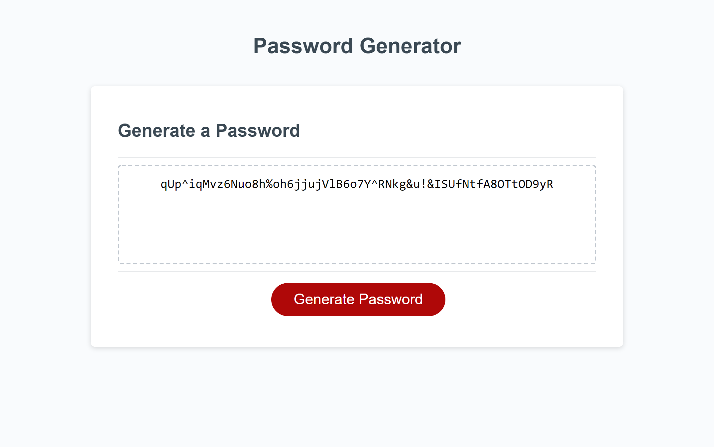

# Module 3 Challenge - Password Generator

## Purpose of this website

This website generates random passwords including uppercase letters, lower case letters, symbols and numeric numbers between 8 - 128 characters long. 

---

## User story
As A junior web-developer

I want to generate a password that meets certain criteria

So THAT I can create a strong and secure password that ensure greater security 

----

## Screenshot
This is the screenshot after a password was generated. 

---

## Links

[My git hub page](https://github.com/Yoko-cyer/Module3-challenge-Password-Generator)

[Deployed Site](https://cheery-melba-85f40a.netlify.app/)